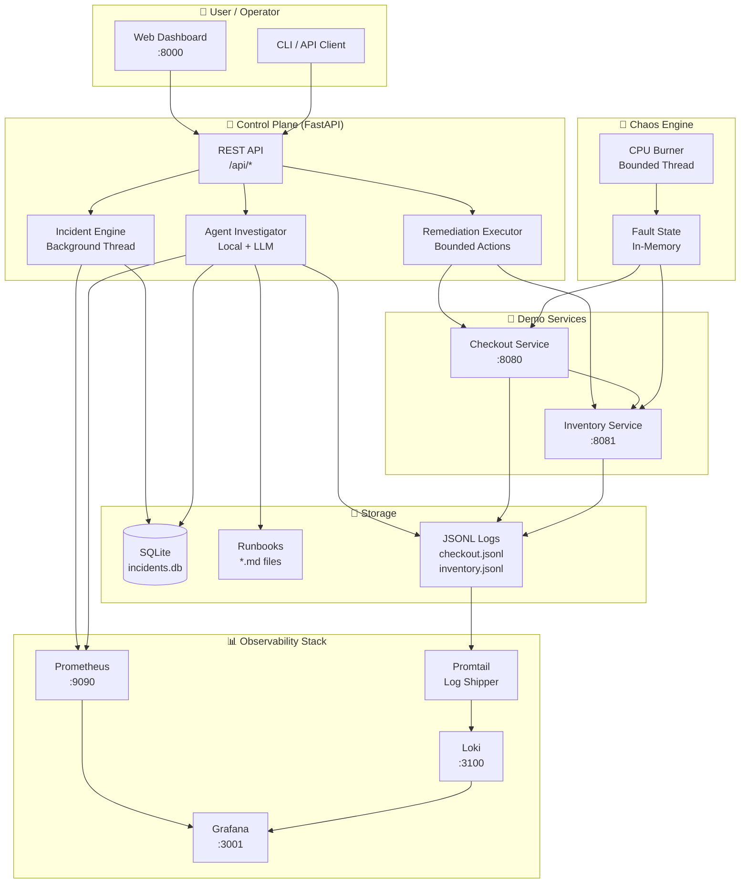
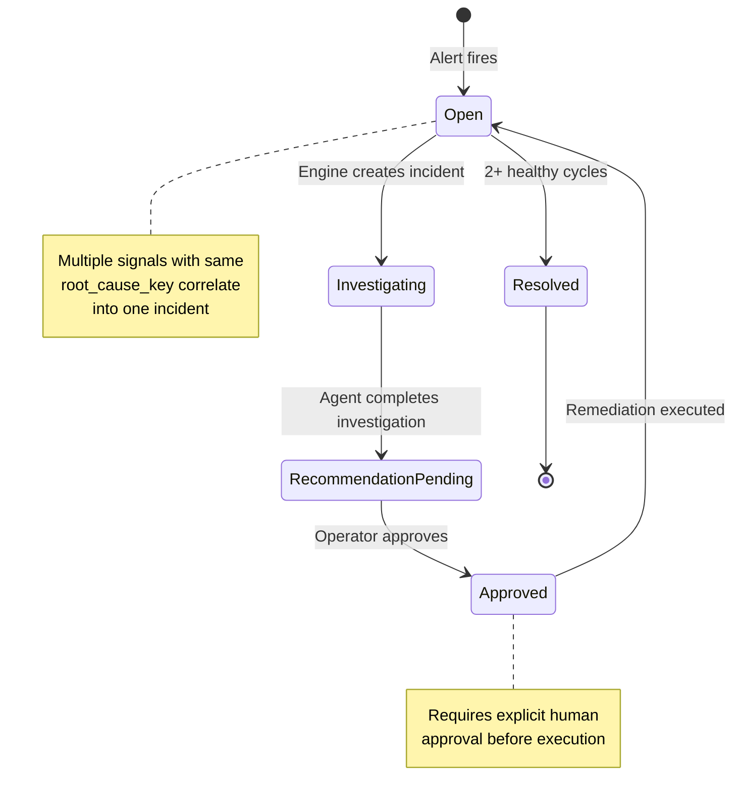

# Aegis Architecture & Security Analysis

## 🏗️ System Architecture



## 🔌 API Endpoints

| Method | Endpoint | Description | Auth |
|--------|----------|-------------|------|
| `GET` | `/` | Web dashboard | No |
| `GET` | `/healthz` | Health check | No |
| `GET` | `/api/overview` | Dashboard overview | No |
| `GET` | `/api/incidents` | List incidents (paginated) | No |
| `GET` | `/api/incidents/export` | Export as JSON/CSV | No |
| `GET` | `/api/incidents/{id}` | Get incident detail | No |
| `POST` | `/api/incidents/{id}/investigate` | Trigger investigation | No |
| `POST` | `/api/incidents/{id}/approve` | Approve remediation | No |
| `POST` | `/api/incidents/{id}/execute` | Execute approved fix | No |
| `POST` | `/api/incidents/batch/approve` | Batch approve all | No |
| `POST` | `/api/chaos` | Inject chaos fault | No |
| `GET` | `/api/metrics` | Prometheus metrics | No |
| `GET` | `/api/logs` | Recent logs | No |
| `GET` | `/api/runbooks` | List runbooks | No |
| `GET` | `/api/audit` | Audit log | No |
| `POST` | `/api/engine/run-once` | Force engine cycle | No |

## 🔄 Incident Lifecycle



## 🔒 Security Analysis

### ✅ Strengths

| Area | Implementation |
|------|----------------|
| **SQL Injection** | Parameterized queries throughout `storage.py` |
| **Path Traversal** | `Path(slug).name` in `_read_runbook()` |
| **Timing Attacks** | `hmac.compare_digest()` for API key comparison |
| **Auth on state changes** | `AEGIS_API_KEY`, when set, guards every mutating control-plane route |
| **Bounded memory** | Audit buffer and rate-limit buckets are capped and evicted |
| **Input Validation** | Pydantic models with regex patterns for fault types |
| **Remediation Safety** | Allowlist-based actions, no shell/Docker access |
| **Thread Safety** | `threading.RLock()` on all SQLite operations |
| **Request IDs** | UUID-based tracking for debugging |

### ⚠️ Risks & Mitigations

| Risk | Severity | Mitigation |
|------|----------|------------|
| **Demo services' `/admin/*` are unauthenticated** | Medium | Only reachable inside the Compose network; add auth before exposing them |
| **CORS allows `*`** | Low (demo) | Credentials are disabled, so cookies are never sent cross-origin; restrict origins for production |
| **In-memory rate limiting** | Low (single instance) | Use Redis for multi-instance deployments |
| **No HTTPS enforcement** | Low | Handle at reverse proxy (nginx/traefik) |
| **No request body size limit** | Medium | Add `app.add_middleware(BaseHTTPMiddleware, max_body_size=1_000_000)` |
| **SQLite not encrypted** | Low (demo) | Use SQLCipher for production |
| **No CSP headers** | Low | Add `Content-Security-Policy` header |
| **OpenAI API key in env** | Low | Use secret manager (Vault, AWS SSM) |
| **No audit persistence** | Medium | Persist `_audit_log` to SQLite |
| **No log rotation** | Low | Use `logging.handlers.RotatingFileHandler` |

### 🛡️ Security Recommendations

1. **Enable API key auth** — Set `AEGIS_API_KEY`; the control room UI does not send the header, so drive the API directly when it is on
2. **Restrict CORS** — Set `CORS_ORIGINS=https://your-domain.com`
3. **Add request body limits** — Prevent large payload attacks
4. **Persist audit log** — Store in SQLite for compliance
5. **Add CSP headers** — Prevent XSS in the dashboard
6. **Use HTTPS** — Deploy behind a TLS-terminating proxy

## 📊 Data Flow

```
User clicks "Inject Fault"
        ↓
POST /api/chaos
        ↓
Control plane → POST /admin/faults → Checkout/Inventory
        ↓
Fault state updated in memory
        ↓
Prometheus scrapes /metrics every 15s
        ↓
Alert rule fires (error rate > 15%)
        ↓
Incident Engine detects → Creates incident in SQLite
        ↓
Agent Investigator runs in background thread
        ↓
  ┌─ Queries Prometheus (metrics)
  ├─ Reads JSONL logs
  ├─ Reads runbook
  └─ Builds evidence + recommendation
        ↓
Status: recommendation_pending
        ↓
Operator clicks "Approve" in dashboard
        ↓
POST /api/incidents/{id}/approve
        ↓
Operator clicks "Execute fix"
        ↓
POST /api/incidents/{id}/execute
        ↓
Remediation Executor → POST /admin/faults/clear
        ↓
Fault cleared → Signals return to normal
        ↓
Status: resolved (after 2 healthy cycles)
```

## 🐳 Docker Compose Topology

```
┌─────────────────────────────────────────────────────────────┐
│                    Docker Network: monitoring                │
│                                                             │
│  ┌──────────┐  ┌──────────┐  ┌──────────┐  ┌──────────┐  │
│  │ Control  │  │ Checkout │  │ Inventory│  │Prometheus│  │
│  │ Plane    │──│ Service  │  │ Service  │  │          │  │
│  │ :8000    │  │ :8080    │  │ :8081    │  │ :9090    │  │
│  └──────────┘  └──────────┘  └──────────┘  └──────────┘  │
│       │                                        │          │
│       │            ┌──────────┐  ┌──────────┐  │          │
│       │            │  Grafana │  │  Loki    │  │          │
│       │            │  :3001   │──│  :3100   │  │          │
│       │            └──────────┘  └──────────┘  │          │
│       │                        ┌──────────┐    │          │
│       │                        │ Promtail │────┘          │
│       │                        └──────────┘               │
│       └──────────────────────────────────────────────────┘│
└─────────────────────────────────────────────────────────────┘
```

## 📈 Prometheus Metrics

| Metric | Type | Labels | Description |
|--------|------|--------|-------------|
| `aegis_http_requests_total` | Counter | service, method, route, status | HTTP requests |
| `aegis_http_request_duration_seconds` | Histogram | service, method, route | Request latency |
| `aegis_dependency_requests_total` | Counter | service, dependency, status | Dependency calls |
| `aegis_dependency_errors_total` | Counter | service, dependency, reason | Dependency errors |
| `aegis_fault_active` | Gauge | service, fault | Active faults |
| `aegis_cpu_burn_active` | Gauge | service | CPU stress active |
| `aegis_simulated_replicas` | Gauge | service | Simulated scale |

## 🔔 Alert Rules

| Alert | Condition | Severity |
|-------|-----------|----------|
| `AppDown` | Prometheus can't reach `/metrics` | critical |
| `HighErrorRate` | > 5% requests return 5xx | critical |
| `HighClientErrorRate` | > 10% requests return 4xx | warning |
| `HighLatencyP99` | P99 latency > 1s | warning |
| `HighHeapUsage` | Heap > 85% | warning |
| `HighMemoryRSS` | RSS > 200MB | warning |
| `HighEventLoopLag` | Event loop lag > 100ms | warning |
| `LowRequestRate` | < 0.01 req/s for 10min | info |

---

*Generated for Aegis v0.3.0*
